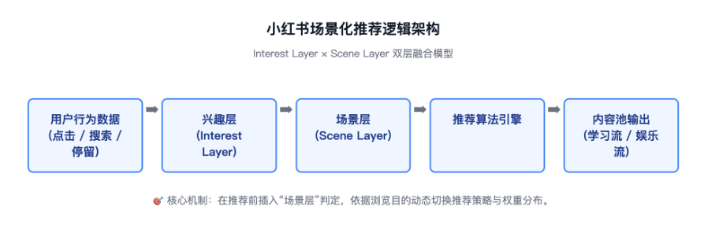

# 小红书场景化推荐模式设计

## 一、项目背景

随着小红书内容生态不断扩张，平台已从早期以"生活方式分享"为核心的种草社区，逐渐演变为覆盖求职、考研考公、技能学习、消费决策、情绪陪伴、娱乐休闲等多元场景的综合内容平台。

与此同时，用户打开小红书的目的也开始出现明显分化：部分用户希望通过平台进行放松娱乐、随机浏览和情绪缓解；另一部分用户则带有明确目标，希望快速获取经验、知识与信息差内容。

但当前首页推荐流仍主要基于用户历史行为进行统一推荐，包括搜索、点击、停留、收藏等行为信号。算法能够持续强化用户兴趣，却缺少对**当前浏览场景**的识别能力。

因此，当用户短时间浏览求职、备考、自律成长等内容后，首页会在后续持续推荐相关高目标、高压力内容。即使用户已经进入下班放松、睡前娱乐、碎片化浏览等休闲场景，仍可能不断接收到"上岸经验""高薪Offer""学习计划"等成长型内容。

这导致平台逐渐出现以下问题：

- 首页内容场景割裂；
- 用户浏览情绪被频繁打断；
- 娱乐体验下降；
- 用户产生"被算法绑架"的失控感；
- 平台长期形成"越刷越焦虑"的用户认知。

因此，当前问题的本质并非"推荐不够精准"，而是当前推荐系统**缺少对用户浏览场景的识别能力**。系统能够识别用户"喜欢什么"，却无法识别用户"为什么在此刻打开小红书"。本项目的目标，是让推荐系统理解"此刻的用户"，而不仅仅是"这个用户"。


## 二、核心问题定义

当前小红书的推荐体系仍建立在以用户历史行为为基础的**统一兴趣模型**之上。系统会根据用户的浏览、搜索、点击与停留等行为，不断强化相应兴趣权重。但在这一过程中，模型**缺乏对场景的动态感知**——它能够判断用户"喜欢什么"，却无法判断用户"此刻想要什么"。

这种机制在早期以消费决策、兴趣种草为主要目的的场景中运作良好，因为用户目标相对一致、兴趣稳定性较高。然而，随着小红书内容生态迅速扩张，用户的使用目的与沉浸场景开始呈现明显的多样化与阶段性差异。

现实使用中，用户的浏览场景是动态变化的。例如，同一个用户：

- 白天可能浏览求职或备考经验；
- 晚上希望放松娱乐、刷轻内容；
- 周末则集中搜索旅行攻略和生活方式内容。

因而，当前推荐系统存在以下几个核心问题：

**（1）娱乐流被学习内容污染**：用户短期浏览学习内容后，首页会长期出现求职、考公、自律、成长焦虑等高压力内容，导致娱乐浏览场景被打断，降低用户放松体验。

**（2）学习流被娱乐内容干扰**：当用户带有明确目标进入平台时，推荐流中仍会混入娱乐八卦、颜值内容、情绪化内容，导致注意力频繁中断，影响信息获取效率与学习连续性。

**（3）系统缺乏主动场景识别机制**：当前用户只能被动接受算法推荐，或依赖搜索、手动切换频道获取目标内容。系统本身缺少帮助用户主动切换浏览场景、隔离不同推荐逻辑的能力。

> **本质上，当前小红书只有"兴趣推荐"，但缺少"场景推荐"。**


## 三、用户洞察

### 3.1 用户需求变化

随着小红书内容生态不断扩张，用户对平台的使用方式已经从单一的"种草浏览"逐渐演变为多场景并存。用户既会在平台中进行娱乐放松、情绪陪伴与碎片化浏览，也会进行求职备考、技能学习、消费决策与信息搜索。

因此，用户打开小红书的核心目的已经不再统一。过去，小红书更偏向“兴趣消费平台”，用户以泛娱乐和生活方式浏览为主，推荐系统只需围绕用户兴趣进行内容分发即可。但当前用户行为已经发生变化：用户不仅存在“兴趣差异”，还存在“场景差异”。

根据用户调研（抽样100人），约 **64%** 用户在不同时间段会切换使用目的，**30%** 用户认为算法推荐与当下状态"不匹配"。同一个用户，在不同时间、不同状态下，对内容的需求完全不同。例如，用户在通勤、睡前时，更倾向于轻松、低压力内容；在备考、求职阶段，则更关注高密度、强目标型内容。用户在娱乐状态下，希望获得随机感与探索感；而在学习状态下，则更强调内容连续性与低干扰。

但当前平台推荐系统，仍主要依据用户历史行为持续强化内容推荐，缺少对用户“当前浏览场景”的理解能力。这也是用户逐渐产生内容混杂、浏览疲劳、推荐失控感以及“越刷越焦虑”等负面体验的重要原因。

> 以上痛点均指向同一根因——推荐逻辑在"兴趣层"停滞，缺少"场景层"建模。

### 3.2 核心用户画像

**用户类型 A：休闲娱乐型用户**

该类用户以高频刷首页为主，偏好碎片化浏览，核心目标是放松、消遣与情绪缓解。通常在下班后、睡前、通勤或短时间碎片化场景中打开小红书，希望获得轻松、低压力、具备随机探索感的内容体验。对高压力、高目标型内容较为敏感。当娱乐浏览过程中频繁出现求职、自律、备考等成长型内容时，容易产生情绪压力与浏览疲劳，进而影响整体使用体验。

**用户类型 B：目标学习型用户**

该类用户通常带有明确目标进入平台，例如求职、考研、技能学习、留学申请或消费决策等。用户会高频搜索、收藏与连续浏览相关干货内容，对内容垂直度、信息密度与连续性要求较高。相比“探索感”，该类用户更关注内容获取效率与推荐精准度，希望在短时间内持续获得高相关信息，并减少娱乐内容对学习状态的干扰。

### 3.3 当前用户核心痛点

| 用户痛点 | 具体表现 |
| --- | --- |
| 内容场景混杂 | 娱乐内容与学习内容混合出现 |
| 算法记忆污染 | 搜索一次学习内容后，首页近期持续推荐相关内容 |
| 浏览情绪被打断 | 用户在休闲场景中持续接收高压力成长内容 |
| 学习效率下降 | 学习过程中混入大量娱乐内容，影响注意力连续性 |
| 缺少推荐控制感 | 用户无法主动管理不同浏览场景与推荐逻辑 |

### 3.4 用户核心需求总结

当前用户真正需要的，并不是单纯"更多频道"或"更细分类"，而是不同场景下对应不同的内容消费体验：

- **娱乐场景**：更轻松、更随机、更低压力的浏览体验；
- **学习场景**：更高的内容精准度、连续性与信息获取效率。

因此，平台需要解决的核心问题并非“内容分类”，而是如何让推荐系统具备对用户浏览场景的识别能力，并根据不同场景提供差异化推荐策略。


## 四、产品核心思路

### 4.1 核心设计思路

本项目的核心目标，并非简单增加频道分类，而是在推荐系统中引入"场景层"，即在"用户兴趣"之外，增加对用户当前浏览状态的识别与管理能力。

当前推荐系统解决的是"用户喜欢什么内容"，而本项目希望进一步解决："用户为什么在此刻打开小红书"。因此，产品方案不再仅围绕兴趣标签进行推荐，而是围绕不同场景下的用户需求，建立差异化内容消费模式。

### 4.2 场景化推荐模式

基于用户行为与内容消费目标，平台将首页内容拆分为两种核心场景：

| 场景类型 | 用户目标 | 推荐特点 |
| --- | --- | --- |
| 娱乐场景 | 放松、消遣、情绪缓解 | 多兴趣混合、随机探索、低压力 |
| 学习场景 | 获取信息、持续学习 | 高垂直度、连续推荐、低干扰 |

两种场景对应不同推荐逻辑，并尽可能减少相互干扰。

### 4.3 娱乐场景设计原则

娱乐内容的核心价值并非“精准”，而是新鲜感、随机感与探索感。用户在娱乐场景下，更希望低成本、低目标压力地浏览内容，而不是持续停留在单一兴趣领域中。

因此，娱乐流不适合过度频道化。若长期停留在单一兴趣频道中，容易导致内容同质化、浏览疲劳以及探索感下降，进而降低用户停留意愿。

基于这一特点，本方案保留首页综合娱乐流，通过多兴趣混合推荐维持内容的新鲜感与发现感。

### 4.4 学习场景设计原则

学习类内容与娱乐内容存在明显差异。用户进入学习场景时，通常带有明确目标，希望快速获取高密度信息，因此更关注内容精准度、连续消费体验与信息获取效率。

因此，学习内容需要建立相对独立的推荐空间，通过频道化方式进行垂直聚合，降低娱乐内容干扰。例如，求职、法考、AI学习、留学申请等内容，可建立独立学习频道，并形成相对独立的兴趣权重与推荐逻辑，以减少内容污染问题。

在双场景体系下，平台可针对不同内容池和推荐模型，实施差异化策略，而非统一加权推荐逻辑。

### 4.5 产品核心价值

通过引入“场景化推荐模式”，平台希望在娱乐与学习之间建立更清晰的内容边界。对于用户而言，该方案能够降低内容焦虑与浏览疲劳，提升娱乐体验与学习效率，并增强用户对推荐系统的控制感；对于平台而言，则能够优化首页内容消费体验，降低**负反馈率**，提升用户**停留时长与留存**，并进一步强化平台场景化内容生态能力。
  

## 五、项目目标

### 5.1 核心目标

首页上线**娱乐 / 学习场景一键切换**功能和多元**学习频道**，实现用户浏览场景隔离。通过场景化推荐模式，让小红书将不再仅仅是记录生活的平台，而将成为理解当下用户状态的伴随式内容助手。

### 5.2 业务目标

#### 5.2.1 用户体验目标

本项目的核心目标，是通过「场景化推荐模式」改善用户在不同浏览意图下的内容体验，降低推荐系统的情绪错配与内容污染。

| 维度 | 用户体验目标 | 说明 |
| --- | --- | --- |
| 内容匹配度 | 降低跨场景内容混杂感 | 明确不同场景推荐策略，减少用户认知负担 |
| 情绪健康度 | 降低浏览焦虑感与负面情绪 | 减少学习类内容在放松场景的强曝光 |
| 信息效率 | 提升学习场景下的信息摄入效率 | 通过推荐聚焦机制提升连续学习体验 |
| 可控感 | 提升用户对推荐的掌控感 | 让用户主动切换不同浏览模式 |
| 心理沉浸度 | 提升单场景内的沉浸感 | 通过"模式一致性"带来更稳定消费体验 |

#### 5.2.2 平台数据目标

所有指标均以现有首页推荐系统为 Baseline，预期在 A/B 测试验证后评估效果。

| 指标分类 | 核心指标 | 目标 | 指标意义 |
| --- | --- | --- | --- |
| 内容消费 | 首页人均停留时长 | +8% | 证明场景化推荐提升沉浸与消费深度 |
| 内容体验 | 首页跳出率 | -5% | 验证内容不匹配率下降带来更平滑体验 |
| 推荐体验 | 用户负反馈率 | -10% | 验证推荐污染率下降 |
| 用户留存 | 次日留存率 | +3% | 体现场景模式对长期留存的正向影响 |
| 场景使用 | 学习模式使用率 | ≥15% | 验证主动内容控制行为被采纳 |
| 场景切换 | 模式切换使用率 | ≥20% | 反映用户理解并使用主动场景机制 |
| 推荐治理 | "减少此类内容"触发率 | ↓ | 验证用户负反馈减少 |
| 学习体验 | 学习模式平均停留时长 | ↑ | 体现连续消费与沉浸学习的形成 |

#### 5.2.3 核心验证指标：场景隔离有效性

| 指标名 | 说明 | 验证逻辑 |
| --- | --- | --- |
| 娱乐流中学习内容曝光占比 | 娱乐模式中学习内容占比 | 验证"内容污染"是否降低 |
| 学习流中娱乐内容曝光占比 | 学习模式中娱乐内容占比 | 验证学习场景的聚焦性 |
| 场景内停留稳定度 | 用户平均停留时长方差 | 衡量场景推荐稳定性与体验一致性 |
| 场景切换频率 | 用户平均日切换次数 | 判断用户是否理解并主动使用场景功能 |


## 六、产品设计方案

### 6.1 产品设计目标

本项目的设计目标是在现有首页推荐体系中增加场景层，让用户能够切换浏览场景。通过最小产品改动，实现娱乐内容与学习内容的推荐隔离，改善推荐“场景错配”问题。

核心目标：

- 降低首页内容混杂度；
- 建立独立学习流，提升学习体验；
- 保持娱乐流的随机性与探索感；
- 提升用户对推荐系统的掌控感。

### 6.2 整体结构设计

```
用户行为数据 → 兴趣层 → 场景层 → 推荐策略引擎 → 内容池输出
```


  
场景层负责判断用户当前处于娱乐或学习模式，并对推荐模型、内容池权重、冷启动逻辑等进行差异化分发。

### 6.3 首页场景切换设计

#### 6.3.1 入口设计

在首页顶部增加一个轻量化场景切换入口：

- 点击可在「学习 / 娱乐模式」 间切换；
- 切换后接口加载不同推荐流；
- 切换按钮支持记忆用户上次状态。

> **设计重点**：入口需轻、反馈快、不打断用户浏览节奏。

#### 6.3.2 学习频道设计

在首页顶部展示横向滑动频道导航栏：

- 点击频道 → 切换对应推荐流
- 左右滑动 → 快速切换频道

#### 6.3.3 页面原型设计


### 6.4 推荐体验控制点

| 控制点 | 说明 | 场景应用 |
| --- | --- | --- |
| 内容池优先级 | 不同场景使用独立内容池权重 | 避免算法污染 |
| 曝光节奏控制 | 限制相同内容类型连续曝光 | 娱乐模式下避免同质化 |
| 冷启动策略 | 新用户按时段触发默认场景 | 晚间默认是娱乐场景 |
| 模式提示 | 首次切换提供轻量场景教育 | 提升用户理解与使用率 |


## 七、MVP 设计

### 7.1 MVP 目标

以最小交互与架构变动，验证"场景切换"机制是否改善推荐体验与用户停留指标。

### 7.2 MVP 范围

| 模块 | MVP 范围 | 非 MVP 内容 |
| --- | --- | --- |
| 首页场景切换入口 | 用户可手动切换"娱乐/学习"模式 | 自动场景识别 |
| 学习模式推荐流 | 独立学习内容推荐 | 个性化子频道推荐 |
| 学习频道导航 | 简化为 3～4 个频道 | 完整自定义频道体系 |
| 用户提示气泡 | 首次教育 | 个性化引导逻辑 |
| 数据跟踪 | 记录切换行为、停留时长、负反馈率 | 模型改造 / 多兴趣池体系 |

### 7.3 MVP 验证路径

1. **灰度上线 A/B 实验**：部分用户随机分配至测试组（添加场景切换入口）；

2. **观测阶段（1～2 周）**：比对用户的负反馈率、首页停留时长、学习频道使用率；

3. **评估阶段（3～4 周）**：MVP 评估以用户理解度与使用意愿为主（学习模式使用率），其次验证体验改善（停留时长、负反馈）。若学习模式使用率 ≥15%、停留时长增长、负反馈下降，则进入全量优化阶段。

### 7.4 关键 MVP 成功标准

| 维度 | 指标 | 成功阈值 |
| --- | --- | --- |
| 使用行为 | 学习模式使用率 | ≥15% |
| 内容体验 | 娱乐流中学习内容曝光占比 | ↓10% |
| 用户体验 | 负反馈率 | ↓8% |
| 沉浸度 | 平均停留时长 | ↑5% |

### 7.5 后续演进方向


## 八、核心业务与用户流程

### 8.1 业务流程说明


### 8.2 用户侧流程说明

```
🧍‍♀️ 用户侧动作                        🤖 系统响应
──────────────────────────────────────────────────
打开小红书 → 默认进入娱乐流            → 推荐系统加载娱乐推荐流
点击【切换】Tab                      → 场景层判定为学习场景
点击某个频道                         → 与兴趣层融合，调用内容池
                                   → 刷新页面展示学习推荐流
浏览 / 点赞 / 收藏                   → 行为上报更新兴趣画像
点击【切换】Tab                      → 重新加载娱乐流
```


## 九、推荐机制

### 9.1 推荐策略架构

本项目对现有推荐系统进行轻量级分层，不更改主算法，仅在推荐入口前新增一层场景层。

**原流程：**
```
用户行为数据 → 兴趣层 → 推荐策略引擎 → 内容池输出
```

**新流程：**
```
用户行为数据 → 兴趣层 → 场景层 → 推荐策略引擎 → 内容池输出
```

### 9.2 场景层判定逻辑

场景层通过多种信号协同判断用户当前状态（MVP 阶段仅部分启用）：

| 信号类型 | 示例 | MVP 是否启用 | 说明 |
| --- | --- | --- | --- |
| 用户手动切换 | 用户点击"学习模式" | ✅ | 主信号，带最高权重 |
| 时间段 | 白天/工作日加权学习场景 | ✅ | 可预设默认权重 |
| 内容交互 | 收藏干货内容占比高 | 暂不启用 | — |
| 停留时长 | 高连续行为触发学习判定 | 暂不启用 | — |

最终场景判定为多信号加权计算，按优先级分配权重：**手动切换 0.7 + 时间段 0.3**。

### 9.3 AI 内容分类系统

#### 9.3.1 分类目标

通过内容语义识别 + 用户场景建模，实现内容与场景的精准匹配与隔离：

- 区分娱乐内容与知识内容，避免内容混流；
- 不同知识主题在频道间独立推荐；
- 降低推荐流中"无关内容污染"；
- 提升推荐结果的场景契合度与内容准确率。

#### 9.3.2 分类维度

| 维度 | 特征来源 | 示例 |
| --- | --- | --- |
| 文本语义 | 标题、正文、评论关键词 | 「金融」「英语」 |
| 作者标签 | 创作者历史发文主题 | 教培向、Vlog 向 |
| 用户行为 | 点赞、收藏、停留人群画像 | 用户偏好类型 |
| 内容目的 | 娱乐 / 学习 / 消费 / 社交等 | 识别内容意图 |
| 视频语义 | OCR、ASR、画面特征 | 自动提取主题元素 |
| 内容标签 | 用户输入或 AI 打标（#考研 #面试 等） | 归类内容主题 |

#### 9.3.3 分类优先级规则

当单个内容满足多个分类标准时，系统按最高**优先级**分类，低优先级标签仍保留用于召回关联。

| 优先级 | 内容类型 | 示例 |
| --- | --- | --- |
| P0 | 强学习目标内容 | 笔记、教程、课程资料 |
| P1 | 强消费决策内容 | 种草、选购、测评类 |
| P2 | 兴趣垂类内容 | 兴趣爱好、知识拓展 |
| P3 | 泛娱乐内容 | Vlog、生活分享、情绪类 |

#### 9.3.4 分类冲突处理

| 情况 | 规则 | 说明 |
| --- | --- | --- |
| 内容跨多个频道 | 主分类进入核心频道；副分类保留标签关联；支持跨频道召回 | 避免内容重复曝光 |
| 分类结果不确定 | 暂入"娱乐推荐流"，系统持续观察用户反馈 | 依靠行为校正 |
| 用户主动纠错 | 用户可"移出频道 / 加入频道 / 减少此类内容"，系统实时调整分类权重 | 提升模型自学习与可控性 |

#### 9.3.5 AI 分类模型迭代规则

系统持续通过以下指标动态优化模型性能：

- 点击率、收藏率、停留时长
- 负反馈率与纠错操作频次
- 内容池分布稳定性

模型周期性重训，确保分类标签与场景语义的时效性与准确性。

### 9.4 推荐隔离机制

建立独立场景内容池与独立推荐，实现真正意义上的“场景隔离”，保障每个场景下的推荐纯度与体验连贯性。逻辑如下：

| 模块 | 内容池策略 | 曝光规则 | 排序权重策略 |
| --- | --- | --- | --- |
| 娱乐模式 | 综合池（70% 娱乐 + 30% 泛生活） | 避免单主题连续曝光 | 兴趣分布均衡，内容丰富度优先 |
| 学习模式 | 学习池（90% 垂直内容 + 10% 轻松内容） | 强化主题连续性 | 信息密度优先，知识相关性优先 |

隔离原则：

- 娱乐行为 → 不影响学习推荐；
- 学习行为 → 不影响娱乐推荐；
- 双场景兴趣池、行为权重、推荐模型完全独立。

同时建立防污染机制： 

| 场景 | 典型污染类型 | 防护策略 |
| --- | --- | --- |
| 娱乐模式 | 学习、求职、压抑类内容混入 | 建立内容屏蔽规则 + 曝光权值惩罚 |
| 学习模式 | 娱乐、颜值、八卦型干扰内容 | 降低非目标内容曝光权 + 强化频道聚合度 |

当系统监测到分类错误率或污染率上升，自动触发**内容再筛机制**（Top20 重筛样本），动态纠正内容分布。

### 9.5 缓存与性能优化机制

为确保场景切换流畅，减少首屏加载延迟，系统采用轻量缓存复用与异步刷新策略：

- **内容复用**：切换场景后，客户端优先展示本地缓存的前若干条内容，保证界面无空白加载；
- **异步刷新**：新场景推荐请求在后台加载完毕后，平滑替换已展示内容，降低"闪屏"感。

此策略可显著降低场景切换时的等待感，确保推荐流的连续性与用户的沉浸体验。

### 9.6 总结

通过引入「场景层机制」，推荐系统在相同用户身份下，对应两套推荐逻辑：

- 当用户想"探索"时，推荐广度优先、轻目标；
- 当用户想"学习"时，推荐深度优先、高相关。

本策略通过「AI语义分类 + 场景化兴趣建模 + 分频道推荐隔离」的三重机制，实现内容与场景的精细匹配，使推荐结果兼具垂直精度与体验纯度。未来版本可独立训练轻量场景分类模型，通过弱监督信号（使用时段、交互类型）学习场景权重映射。
  

## 十、指标体系与埋点设计

> 本章节指标体系与第五章"项目目标"相衔接。第五章定义项目目标的业务预期；本章节则从数据采集与追踪角度，说明这些目标在系统中的埋点方式、计算口径与验证机制。

### 10.1 指标体系设计

#### 10.1.1 指标分层结构

| 层级 | 指标类型 | 说明 |
| --- | --- | --- |
| 业务层 | 用户体验相关指标 | 反映场景切换对使用行为及停留的提升效果 |
| 推荐层 | 推荐准确度 / 污染率等性能指标 | 验证场景机制对推荐效果的影响 |
| 系统层 | 性能、延迟与稳定性 | 保障场景切换后系统负载与响应质量 |

#### 10.1.2 核心指标定义

| 指标类别 | 指标名称 | 定义公式 / 含义 | 目标趋势 | 来源 |
| --- | --- | --- | --- | --- |
| 内容体验 | 场景污染率（Scene Pollution Rate） | 场景内非目标内容曝光占比 | ↓ | 推荐日志内容标签比对 |
| 内容体验 | 学习模式平均停留时长 | 学习模式推荐页停留平均时间 | ↑ | 前端停留埋点 |
| 使用行为 | 学习模式使用率 | 使用学习模式的用户占总活跃用户比例 | ≥15% | 切换日志埋点 |
| 使用行为 | 模式切换率 | 日均手动切换次数 / 活跃用户数 | ≥20% | 行为日志 |
| 用户体验 | 负反馈率 | 负向反馈触发次数 / 曝光次数 | ↓8% | 推荐埋点系统 |
| 沉浸度 | 平均刷屏深度 | 用户每次浏览滑动次数 | ↑5% | 页面浏览埋点 |
| 推荐性能 | CTR@Scene | 不同场景下点击率 | ↑ | 推荐日志拆分 |
| 系统性能 | 首屏加载延迟（ms） | 切换模式后到首屏加载完成的时间 | ≤200ms | 前端性能埋点 |

#### 10.1.3 关键验证指标（KPI）

| 指标 | 验证逻辑 | 成功阈值 |
| --- | --- | --- |
| 学习模式使用率 | 反映功能认知与主动使用意愿 | ≥15% |
| 娱乐流学习内容曝光比例 | 验证"内容污染"是否下降 | ↓10% |
| 负反馈率 | 验证用户体验改善与推荐匹配度 | ↓8% |
| 平均停留时长 | 验证沉浸体验效果 | ↑5% |

### 10.2 埋点设计

埋点体系以"用户操作 → 推荐分发 → 内容消费"三阶段行为链路为核心结构，覆盖场景切换、内容曝光、停留、反馈等全流程。

| 模块 | 埋点名称 | 埋点字段 | 触发时机 | 说明 |
| --- | --- | --- | --- | --- |
| 场景切换入口 | `scene_switch_click` | user_id, old_scene, new_scene, timestamp | 点击模式切换按钮时 | 记录切换行为与用户偏好趋势 |
| 推荐首屏曝光 | `scene_feed_first_expose` | user_id, scene_type, content_ids[], latency_ms | 首屏内容加载完毕 | 监控性能 + 曝光纯度验证 |
| 内容曝光 | `feed_expose` | content_id, scene_type, category_tag | 每次内容出现 | 用于计算污染率、CTR |
| 内容点击 | `feed_click` | content_id, scene_type, dwell_time | 用户点击内容卡片 | 用于计算 CTR@Scene |
| 停留时长 | `feed_dwell` | scene_type, duration_ms | 用户停留在页面时长 >1s 时 | 用于计算沉浸指标 |
| 负反馈行为 | `feed_dislike` | user_id, content_id, scene_type, reason | 触发"不感兴趣/举报"等 | 用于计算负反馈率 |
| 频道切换 | `learning_channel_switch` | old_channel, new_channel, duration_prev | 学习模式下切换频道时 | 分析频道切换满意度 |
| 性能监控 | `scene_switch_latency` | device_type, latency_ms | 每次场景切换加载时 | 确保切换不卡顿 |

### 10.3 数据追踪与验证流程

项目验证数据分为**用户行为数据**与**系统性能数据**两类，通过统一数据管道汇总与监控看板追踪。
#### step1. 用户行为数据追踪

采集切换、曝光、点击、停留、负反馈等关键行为，用于验证用户体验及推荐效果。

- **采集埋点**：`scene_switch_click`、`feed_expose`、`feed_click`、`feed_dwell`、`feed_dislike`；
- **日聚合指标**：学习模式使用率、场景污染率、CTR、平均停留时长。
#### step2. 系统性能监测 

为保障交互流畅和推荐结果稳定，系统同步监控关键性能指标：

- **首屏加载延迟(ms)**：从切换点击到首屏渲染完成的时间，目标 ≤200ms；
- **缓存命中率(%)**：记录复用缓存内容比例，目标 ≥80%；
- **推荐响应时延(ms)**：推荐接口整体耗时；
- **异常率(%)**：因超时或内容池错误导致的异常请求比例。

性能数据通过前端性能埋点及推荐服务日志实时上报；若波动超过阈值，将自动触发 QA / SRE 通知。 
#### step3. 验证方式

所有指标按日汇总，在实验看板中与第五章定义的目标对齐；每两周进行一次指标复盘，形成**数据 → 策略 → 优化**的闭环。


## 十一、技术风险与解决方案

| 风险点 | 可能问题 | 解决方案 |
| --- | --- | --- |
| 网络延迟过高 | 切换场景时页面空白或卡顿 | 启用预加载与缓存渲染机制 |
| 冷启动推荐不准 | 新场景数据稀疏 | 混入探索样本 + 加权修正逻辑 |
| 日志采集过多 | 客户端耗电或上传卡顿 | 使用批量合并上传和低频埋点策略 |
| 算法污染残留 | 内容池未即刻切换 | 引入内容再筛机制（Top20 内容重置） |


  